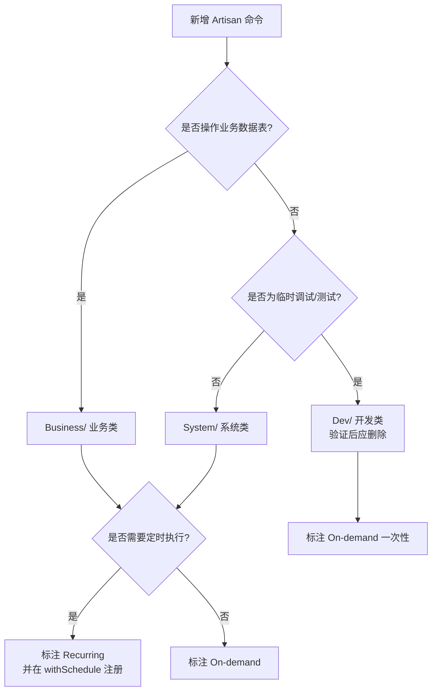

# Console Commands 命令分类说明

> 本目录存放所有 Artisan 命令。按 **领域** 与 **执行频率** 两个维度分类管理。

## 目录结构

```
app/Console/Commands/
├── README.md                          ← 本文档
├── Business/                          ← 业务类命令（业务数据维护 / 统计刷新）
│   └── SyncDashboardStatsCommand.php
├── System/                            ← 系统类命令（权限 / 菜单 / RBAC 基础设施）
│   ├── GeneratePermissionsCommand.php
│   ├── SeedRbacCommand.php
│   └── SyncMenuPermissionCommand.php
└── Dev/                               ← 开发 / 调试类命令（临时测试，不进入生产）
    └── TestQueueCommand.php
```

## 分类维度

### 1. 按领域分类（目录）

| 目录 | 含义 | 判断标准 |
|------|------|----------|
| `Business/` | **业务类** — 处理业务数据（产品、RFQ、库存、统计等） | 命令读写业务表、影响线上业务数据展示 |
| `System/` | **系统类** — 维护系统基础设施（权限、菜单、RBAC、配置） | 命令操作 `admin_*` 系统表或生成配置文件，与业务数据无直接关系 |
| `Dev/` | **开发 / 调试类** — 临时验证、手动测试用 | 一次性调试代码，不应用于生产环境，验证完成后应清理 |

### 2. 按执行频率分类（标注在每个命令标题注释中）

| 类型 | 含义 | 典型场景 |
|------|------|----------|
| **定时任务（Recurring）** | 由 Laravel 调度器按周期自动执行 | 已在 `bootstrap/app.php` 的 `withSchedule()` 中注册 |
| **按需任务（On-demand）** | 人工手动执行，无调度 | 部署初始化、新增路由后同步、临时维护 |

### 命令归类决策流程



## 命令清单

| 命令 signature | 文件 | 领域 | 频率 | 说明 |
|---------------|------|------|------|------|
| `dashboard:sync-stats` | `Business/SyncDashboardStatsCommand` | 业务 | 定时（每小时） | 刷新后台工作台统计数据快照 |
| `admin:generate-permissions` | `System/GeneratePermissionsCommand` | 系统 | 按需 | 为资源路由的 lang 文件生成权限配置块 |
| `admin:seed-rbac` | `System/SeedRbacCommand` | 系统 | 按需（部署初始化） | 生成 RBAC 基础数据并绑定超级管理员 |
| `admin:sync-menu-permission` | `System/SyncMenuPermissionCommand` | 系统 | 按需 | 扫描路由同步菜单表与权限表 |
| `test:queue` | `Dev/TestQueueCommand` | 开发 | 按需（临时） | 测试队列任务派发，**不应进入生产** |

## 命令详细说明

---

### Business（业务类）

#### `dashboard:sync-stats` — 刷新工作台统计数据

- **文件**：`Business/SyncDashboardStatsCommand.php`
- **频率**：定时，每小时执行（`bootstrap/app.php` 中 `->hourly()->withoutOverlapping()`）
- **作用**：聚合大表数据（产品 500 万+、RFQ、用户、库存等）写入 `dashboard_stats` 表，供后台 Dashboard 快照读取，避免实时扫描大表
- **手动执行**（首次部署或需立即刷新时）：

  ```bash
  php artisan dashboard:sync-stats
  ```

- **写入的数据项**：
  - `product_total` — 产品总数
  - `category_total` — 一级分类数
  - `manufacturer_total` — 品牌数
  - `rfq_total` / `rfq_today` — RFQ 总数 / 今日新增
  - `rfq_trend_30d` — 近 30 天 RFQ 趋势（含 labels/values 元数据）
  - `user_total` / `user_today` — 用户总数 / 今日新增
  - `stock_*` — 各库存类型计数（coming/immediately/customer/hot_sale）
  - `category_distribution` — 一级分类产品分布 Top 10

---

### System（系统类）

#### `admin:generate-permissions` — 生成权限配置块

- **文件**：`System/GeneratePermissionsCommand.php`
- **频率**：按需（新增资源路由后运行）
- **作用**：扫描 `app/Admin/routes.php` 中的资源路由，为对应 lang 文件（`lang/zh_CN/xxx.php`）自动补充 `permissions` 配置块，并列出需手动添加 `permissionLabel()` 的单路由
- **用法**：

  ```bash
  # 预览模式（默认，不写文件）
  php artisan admin:generate-permissions

  # 实际写入
  php artisan admin:generate-permissions --write

  # 指定语言包
  php artisan admin:generate-permissions --lang=zh_CN --write
  ```

#### `admin:seed-rbac` — 生成 RBAC 基础数据

- **文件**：`System/SeedRbacCommand.php`
- **频率**：按需（**部署初始化**或 RBAC 结构重建时运行）
- **作用**：清空并重建角色、权限树、权限-菜单关联，将 `user_id=1` 绑定为超级管理员（administrator）
- **⚠️ 危险操作**：`--write` 模式会 TRUNCATE 以下表，数据不可恢复：
  - `admin_role_users`、`admin_role_permissions`、`admin_role_menu`
  - `admin_permission_menu`、`admin_permissions`、`admin_roles`
- **用法**：

  ```bash
  # 预览模式（默认，不写数据库）
  php artisan admin:seed-rbac

  # 实际写入（清空并重建）
  php artisan admin:seed-rbac --write
  ```

#### `admin:sync-menu-permission` — 同步菜单与权限

- **文件**：`System/SyncMenuPermissionCommand.php`
- **频率**：按需（新增资源路由后运行）
- **作用**：扫描 `app/Admin/routes.php`，将资源路由同步写入 `admin_menu` 表和 `admin_permissions` 表，自动建立 `admin_permission_menu` 关联。权限树形结构与菜单保持一致
- **用法**：

  ```bash
  # 预览模式
  php artisan admin:sync-menu-permission

  # 实际写入
  php artisan admin:sync-menu-permission --write
  ```

- **执行顺序建议**：新增路由后，先运行本命令同步菜单与权限，再运行 `admin:generate-permissions` 生成 lang 权限块

---

### Dev（开发 / 调试类）

#### `test:queue` — 测试队列派发

- **文件**：`Dev/TestQueueCommand.php`
- **频率**：按需（**临时调试**）
- **作用**：向 `ChipProductStockImportJob` 派发一个 `task_id=1` 的队列任务，用于验证队列配置
- **⚠️ 注意**：此命令为临时调试代码（硬编码 `Task::where('id', 1)`），**不应进入生产环境**。验证完成后建议删除或替换为带参数的正式命令

---

## 调度配置

定时任务在 `bootstrap/app.php` 中通过 `withSchedule()` 注册：

```php
->withSchedule(function (Schedule $schedule) {
    // 每小时刷新后台工作台统计数据（大表聚合写至 dashboard_stats）
    $schedule->command('dashboard:sync-stats')->hourly()->withoutOverlapping();
})
```

> **注意**：调度通过命令 signature 字符串引用（如 `dashboard:sync-stats`），与命令文件所在的子目录无关。移动命令文件到子目录不影响调度执行。

## 新增命令规范

1. **选择目录**：参照上方决策流程图，放入 `Business/`、`System/` 或 `Dev/`
2. **命名空间**：必须与目录结构匹配（PSR-4）：
   - `App\Console\Commands\Business\XxxCommand`
   - `App\Console\Commands\System\XxxCommand`
   - `App\Console\Commands\Dev\XxxCommand`
3. **signature 前缀**：建议按领域使用前缀，便于辨识：
   - 业务类：`dashboard:*`、`business:*` 等业务名词
   - 系统类：`admin:*`（权限/菜单/RBAC 相关）
   - 开发类：`test:*`、`dev:*`
4. **类注释**：在文件头部注明用途、用法示例、是否为定时任务
5. **定时任务**：若需定时执行，在 `bootstrap/app.php` 的 `withSchedule()` 中注册，并加 `withoutOverlapping()` 防止重叠
6. **更新文档**：新增命令后，在本文档「命令清单」表格和「命令详细说明」中补充条目
7. **Dev 类命令**：验证完成后及时删除，避免污染生产环境

## 自动加载说明

项目使用 Laravel 11 的 `withCommands()`（见 `bootstrap/app.php`），会自动递归扫描 `app/Console/Commands` 及其所有子目录，按 PSR-4 规则解析类名并注册命令。因此：
- 命令放入子目录后，无需手动注册
- 命名空间必须与目录层级一致，否则无法被自动加载
