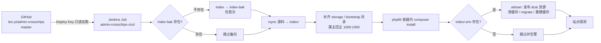

# admin.crosschips.com Jenkins CI/CD 部署手册（antophealth）

> 目标主机：`45.32.89.112`（`ssh antop`，端口 27911）
> Jenkins：`https://ci.opctl.dev`（容器 `1Panel-jenkins-XDRg`，8080）
> 站点目录：`/opt/1panel/www/sites/admin.crosschips.com/index`（PHP 容器 `php85`）
> 上一次部署留下的完整旧版本：`/opt/1panel/www/sites/admin.crosschips.com/index-bak`

## 1. 整体流程



要点：

- **不做镜像**：本项目的运行态是「宿主目录 + 1Panel 的 php85 容器」，与 crosschips.com 前端（不可变镜像）不同。
- **借宿主 Docker 干活**：Jenkins 容器挂了 `/var/run/docker.sock`，脚本用一次性 `alpine` 容器挂载宿主目录做 rsync / 改属主（容器内看不到 `/opt`）。
- **`.env` 与 `storage` 不进同步**：rsync 排除 `.env`、`storage/`、`bootstrap/cache/`，所以密钥与运行时数据不会被覆盖。
- **`index-bak` 是最后一道防线**：首次部署前自动把整个 `index/` 改名保留，失败时可整目录回切。

## 2. 组件与路径

| 组件 | 路径 / 位置 |
| --- | --- |
| Jenkins Job | `admin-crosschips-cicd`（Pipeline script from SCM） |
| Job 配置 | 容器 `/var/jenkins_home/jobs/admin-crosschips-cicd/config.xml`<br/>宿主 `/opt/1panel/apps/jenkins/jenkins/data/jobs/admin-crosschips-cicd/config.xml` |
| 部署私钥 | `$JENKINS_HOME/deploy/ssh/id_ed25519_admin`（公钥需加到 GitHub Deploy keys） |
| Jenkins 凭据 | `admin-crosschips-deploy-key`（SSH 私钥，引用上面那把 key） |
| 已部署 commit 记录 | `$JENKINS_HOME/deploy/admin-crosschips.commit` |
| 仓库内脚本 | `Jenkinsfile`、`ci/jenkins-deploy.sh`、`ci/jenkins-healthcheck.sh` |
| PHP 容器 | `php85`（`1panel-php-fpm:8.5.10`），宿主 `/opt/1panel/www` → 容器 `/www` |

> Jenkins 容器只挂了 `data:/var/jenkins_home`、`docker.sock`、`/usr/bin/docker`，所以私钥放在 `JENKINS_HOME`（持久卷）里。

## 3. 触发方式

| 方式 | 说明 |
| --- | --- |
| GitHub push Webhook | 仓库 Settings → Webhooks → `https://ci.opctl.dev/github-webhook/`，Content type `application/json`，事件选 Just the push event。Secret 用 Jenkins 凭据 `github-webhook-shared-secret` 的值（与 crosschips-backend-java 仓库 webhook 保持同一个） |
| 手动 | Jenkins 页面 `admin-crosschips-cicd` → **立即构建** |
| Build Token | `curl -X POST "https://ci.opctl.dev/job/admin-crosschips-cicd/build?token=588f0c6c8ac1c22b158370d945c66c68"`（Jenkins 开了 CSRF，无登录态时该方式会被 crumb 拦掉，建议用前两种） |

## 4. 首次配置：Deploy Key（必做）

服务器上生成的公钥（仅对 `leo-yi/admin-crosschips` 一个仓库生效）：

```
ssh-ed25519 AAAAC3NzaC1lZDI1NTE5AAAAIIlhaEiBvU5/mrhaMkPGP7xI/XsyT0SRA0CmxkQbWHEs jenkins-ci-admin-crosschips@antophealth
```

添加位置：GitHub 仓库 → Settings → **Deploy keys** → Add deploy key → 粘贴公钥，**不要**勾选 Write access。

验证是否生效（在宿主机执行）：

```bash
docker exec 1Panel-jenkins-XDRg sh -c \
  'ssh -i /var/jenkins_home/deploy/ssh/id_ed25519_admin \
       -o UserKnownHostsFile=/var/jenkins_home/deploy/ssh/known_hosts \
       -o StrictHostKeyChecking=yes -T git@github.com'
# 期望：Hi leo-yi/admin-crosschips! You've successfully authenticated...
```

## 5. 日常操作

```bash
# 部署目录
ls -la /opt/1panel/www/sites/admin.crosschips.com/index

# 查看 Jenkins 构建日志（无需登录）
tail -f /opt/1panel/apps/jenkins/jenkins/data/jobs/admin-crosschips-cicd/builds/*/log

# 在 php85 容器内执行 artisan
docker exec -it php85 sh -c 'cd /www/sites/admin.crosschips.com/index && php artisan optimize:clear'

# 队列消费者（Excel 库存导入）
docker exec php85 sh -c 'cd /www/sites/admin.crosschips.com/index && php artisan queue:work --queue=chip_product_stock_import'
```

### 回滚

代码回滚直接换目录（`index-bak` 是首次部署前那套完整代码，含它的 `vendor`）：

```bash
D=/opt/1panel/www/sites/admin.crosschips.com
mv $D/index $D/index.failed.$(date +%Y%m%d%H%M%S)
mv $D/index-bak $D/index
```

## 6. 人工维护项（流水线不做）

| 项 | 说明 |
| --- | --- |
| nginx root | 必须是 `/www/sites/admin.crosschips.com/index/public`；当前配置指向 `index`，会返回 403。配置文件 `/opt/1panel/www/conf.d/admin.crosschips.com.conf` |
| `index/.env` | Laravel 只认项目根下的 `.env`。站点根 `/opt/1panel/www/sites/admin.crosschips.com/.env` 需要落到 `index/.env`；补齐后重跑一次流水线，artisan 步骤才会执行（migrate / 缓存） |
| 队列 worker | `chip_product_stock_import` 队列消费者需常驻（php85 容器的 supervisor 或 1Panel 计划任务） |
| PHP 扩展 | php85 已补装 `sodium`（`dcat-plus/laravel-admin → tymon/jwt-auth → lcobucci/jwt` 需要）。扩展文件在 `/opt/1panel/runtime/php/php85/extensions/`，若在 1Panel 面板重建 PHP 环境后丢失，需重新安装 |

## 7. 常见问题

| 现象 | 处理 |
| --- | --- |
| 构建日志 `Permission denied (publickey)` | Deploy Key 没加到 GitHub 仓库（或加到了别的仓库） |
| `composer install` 报缺 `ext-xxx` | 到 1Panel 给 php85 装对应扩展（或 `docker-php-ext-install`），然后 `kill -USR2 <php-fpm master pid>` 优雅重载 |
| 流水线黄灯（UNSTABLE） | 代码已部署成功，只是站点探测没过：看 `ci/jenkins-healthcheck.sh` 的输出（403 = nginx root 没指到 `public`，5xx = `.env`/DB/Redis 问题） |
| rsync 报 `apk add rsync 失败` | 服务器到 Alpine 源不通，可在 php85 容器里改成手工 rsync，或改用其他带 rsync 的镜像 |
| 属主不对（写成 root） | 脚本最后有 `chown -R 1000:1000`；若手工操作请自行 `chown -R linuxuser:linuxuser .../index` |

## 8. 与旧部署方式的区别

| | 旧（`deploy/deploy.sh` 手工 rsync） | 现在（本机 Jenkins） |
| --- | --- | --- |
| 触发 | 服务器上手动执行 | GitHub push / Jenkins 手动 |
| 同步 | `git pull` + rsync（含 `.` 通配排除） | Deploy Key 拉码 + rsync 到 `index/` |
| 备份 | 无 | 首次自动保留整份 `index-bak` |
| 失败可见性 | 看脚本日志 | Jenkins 构建记录 + 站点探测 |
